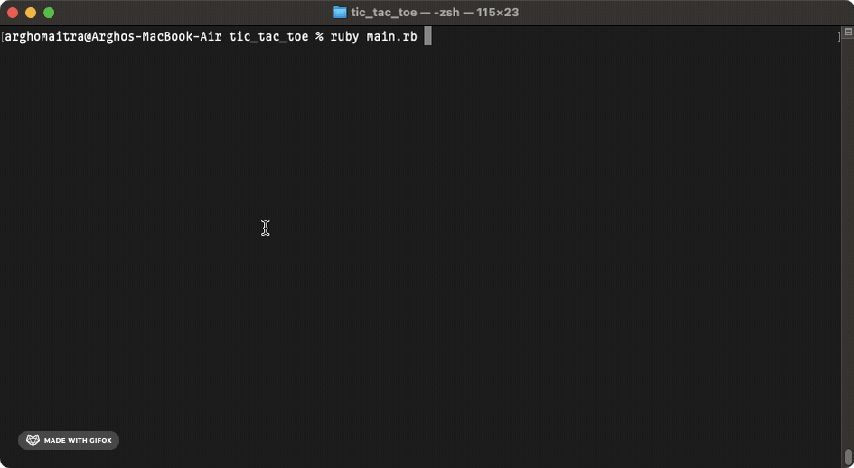

  <h1>Tic Tac Toe</h1>

  

  A Command Line Version of Tic Tac Toe

## About
`tic-tac-toe` is a command line version of the eponymous paper-and-pencil game for two players who take turns marking the spaces in a three-by-three grid with Xs or Os. The winner is the one who succeeds in placing three of their marks in a horizontal, vertical, or diagonal row.[^1]

[^1]: [This project](https://www.theodinproject.com/lessons/ruby-tic-tac-toe) is from the [Ruby Course](https://www.theodinproject.com/paths/full-stack-ruby-on-rails/courses/ruby) in [The Odin Project](https://www.theodinproject.com/about).

## Showcase

  
  

  
This is a screen cast of a win in the Tic Tac Toe game.

  
  

  
This is a screen cast of a tie in the Tic Tac Toe game.

  
  

  
This is a screen cast of an error in the Tic Tac Toe game.

## Technologies
- ***Git***
- ***CLI***
- ***Ruby***
- ***Replit***
- ***GitHub***

## Setup & Usage

### Setup
- The Ruby version for this project 3.3.5.
- `bundle install` installs the gems locally.
- `bundle exec ruby [filename]` runs the file.

### Usage
- For local use, users can either [fork](https://docs.github.com/en/pull-requests/collaborating-with-pull-requests/working-with-forks/fork-a-repo) and/or [clone](https://docs.github.com/en/repositories/creating-and-managing-repositories/cloning-a-repository) the repo, or
  - `bundle install` and `bundle exec ruby main.rb` to play the game.
- For remote use, users can try to directly run the game on [replit](https://replit.com/).
  - click on `Run on Replit` and then click on `Confirm and close` to play the game.

## Self Reflections
- > This project felt like more of a headache than [the previous ones](https://github.com/ohgrmait). The introduction and considerable use of OOP (object oriented programming) throughout this project made it harder for me to complete it. On top of that, the project specifications provided very little scaffolding so this was the very first project where I had to think on what entities would qualify for good classes and instance methods. I also had to do quite a bit of error handling to make sure the user input was clean and appropriate. Overall, it was a very satisfying experience which made me more confident in my newly obtained OOP sea legs.

## Acknowledgements
- Credit for README goes to [ritaly's README cheatsheet](https://github.com/ritaly/README-cheatsheet) and [ArjunSaili1's comment](https://github.com/TheOdinProject/curriculum/discussions/25472#discussioncomment-5889343).

## Contact and Support
- Please do not hesitate to contact me at ***ohgrmait_02945*** on discord for any project queries.
- This project will no longer be worked upon and no further support will be provided for this project.